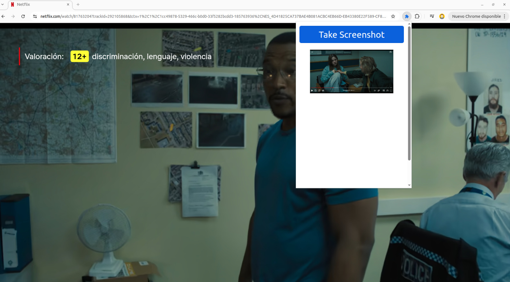
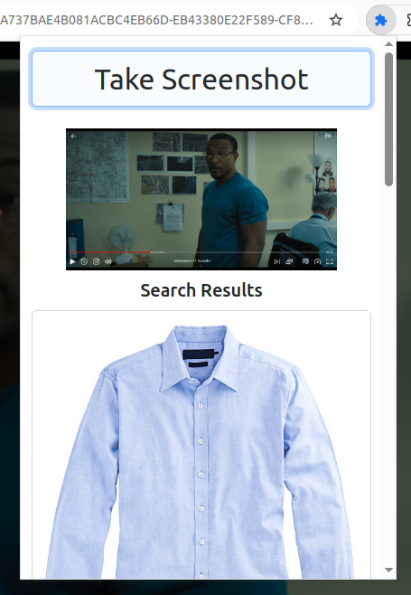
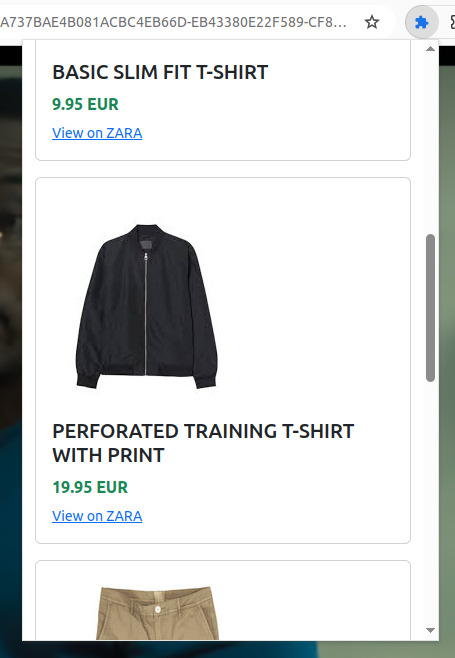

# 🔍 I Want It, I Got It – Chrome Extension

## 💡 Inspiration
We have been inspired by the TikTok trend **"I want it, I got it"** shown by our girlfriends.

## 🛠️ What it does
We wanted to make a **Chrome extension** that detects clothing items visible in **pictures, videos, movies, or series** and, using the **Inditex API**, displays the most similar results from Inditex so users can **buy them**.

## 🧱 How we built it
We built the extension using:
- **JavaScript**
- **HTML**
- **CSS**

We also used **Bash scripts** for debugging API token requests during development.

## 🚧 Challenges we ran into
The **authentication protocol** was new to us, so we spent extra time understanding and implementing it correctly.

## 🧰 Built With
- `bash`
- `css`
- `html`
- `javascript`
